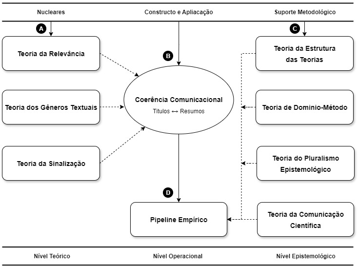
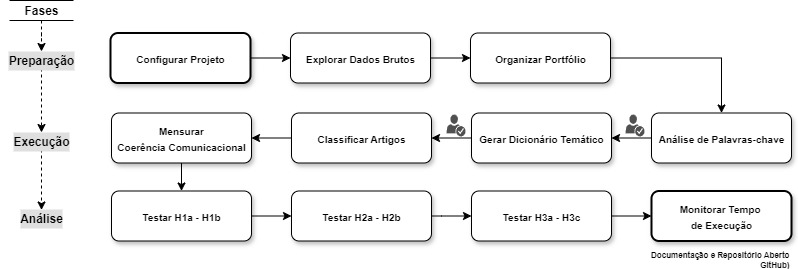

Disponibilizamos um pipeline aberto para mensurar Coerência Comunicacional (CC) — alinhamento semântico título↔resumo — em artigos científicos.

O repositório reúne notebooks prontos para uso (plug-and-play) com SBERT e OLS robusto, permitindo replicar, auditar e estender a pesquisa em outras áreas do conhecimento.

Franework de Coerência Comunicacional (CC)

  

Pipeline de Coerência Comunicacional (CC)

  

Por que usar?
Métrica replicável de CC aplicável além da Contabilidade.
Pipeline modular: da limpeza à modelagem e visualização.
Ciência aberta: scripts documentados e resultados auditáveis.

Replique rapidamente!
Baixe/Clone este repositório.
Coloque o CSV exportado da Scopus na mesma pasta dos notebooks.
Leias as instruções de cada script antes de rodar.
Os resultados (tabelas e figuras) são salvos em .csv/.xlsx/.png.
Entrada mínima (Scopus): Title, Abstract, Author Keywords, Cited by, SJR Quartile, Year, Country.
Saídas típicas: dicionário temático, classificação por eixo, score de CC, estatísticas, gráficos.

Se você organizar pastas adicionais, a estrutura recomendada é:
pln_auditoria/
  ├─ notebooks/        # .ipynb (produção)
  ├─ data/             # insumos (.csv) - fora do versionamento grande
  ├─ results/          # tabelas e figuras geradas
  └─ docs/img/         # figures do README (framework_cc.png, pipeline_cc.png)

Dependências
Python 3.10+
pandas, numpy, sentence-transformers, scikit-learn, statsmodels, matplotlib
Dica rápida: pip install -U pandas numpy sentence-transformers scikit-learn statsmodels matplotlib

Como contribuir / replicar
Use este repositório como base de comparação (fork).
Adapte o CSV para outros domínios (Saúde, Educação, ESG, TI público).
Compartilhe issues com novos eixos temáticos, thresholds ou modelos de linguagem.

Citação:
G.O & Rosa (2025)
